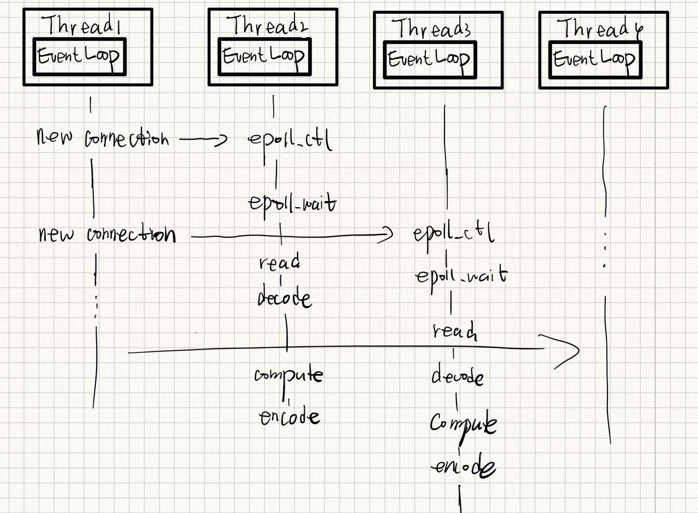
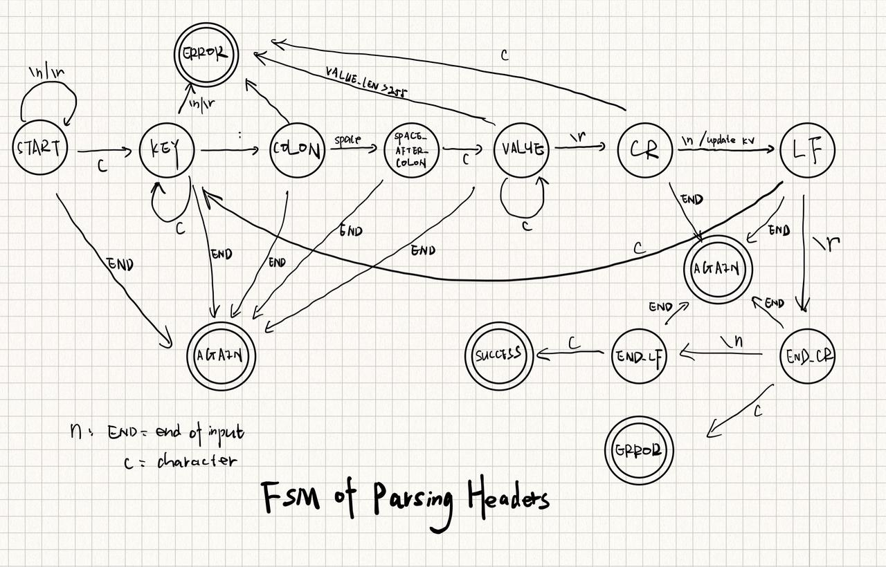

# Description
FlashWebserver is a C++ 11 based Webserver. On the basis of implementing basic tcp communication, HTTP request&response is supported, including most features of http1.0 & http1.1. 
# Environment
- 4vCPUs | 8GiB | c7.xlarge.2 CentOS 8.2 64bit | SSD 40 GB
- g++ (GCC) 8.5.0
- cmake version 3.3.2
- C++11
# Features
- Lightweight and high-performence
- Epoll & non-block socket
- Reactor
- Mutilthread
- Http,persistent connections and pipelining support
- Uses Modern C++
# Usage
```
cd FlashWebserver/build/
sh ../build.sh
./FalshWebserver
```
# Result
[Result doc](docs/test_result.md)

# Framework
## Reactor

### Main Objects
- Thread
- Eventloop
- Epoller
- Channel  

One eventloop per thread.\
One epoller per eventloop. Uses edge-triggered mode to monitoring multiple fds in one eventloop to see if I/O is possible on any ofthem.\
One eventloop contains multiple channels.\
One channel is responsible for a fd(socket connection)'s read,write,connection state update and close.  
  
The main thread which contains the main eventloop is responsible for the establishing of all new connections.then the round robin strategy is used to assign these connections to other eventloops(threads).Essentially,the fd(file descriptor) is assigned to the epoller of the target eventloop by EPOLL_CTL.

### Why is reactor faster
- mutil-thread,take full advantages of cpu
- non-block IO & epoll(edge-triggered), avoid connection waiting for IO one by one.


## HTTP
### HTTP URI Parsing

### pipelining
Before the response arrives, multiple requests can be put into the buffer. When the first request is sent to the server, the second and third requests can also be sent. It is unnecessary to wait until the first request responds back. Under high latency network conditions, this can reduce the network loopback time and improve performance.
### HTTP header parsing
### HTTP body parsing
### keep-alive
Http without keep-alive useds a new tcp connection every request round, which causes frequent tcp connecting & disconnecting. keep-alive allow multiple http request to use one tcp connection, this connection will kepp a specific duration before disconneting.

## Timer
### where to use timer?
- keep-alive = true, use timer to decide when a connection expired(2)
- keep-alive = false, when a connection is blocked by IO for too long, this connection should be set to disconnected.
### how it works?
reference to 《High Performance Linux Server Programming》  

use min-heap(priority_queue in c++) to implement timer. the lateset expire time is the root time. compare to the timer with fixed-frequency, this timer has more accurate.  
the time complexity of adding/deleting timer is O(logn)  
since queue is not able to be accessed randomly, but we really have the need to extend the expire time of a certain timer node. we choose to:  
- set the target timernode *deleted*
- add a new timernode to replace the old one, which carries the updated expire time
- when deleting the expired tiemrnode(root node), the nodes which have been set *deleted* would be deleted,too.
### when to check expire?
every time when epollwait timeout occurs(EPOLLWAIT_TIMEOUT is set to 5s in FlashWebserver)

# Code count
Date : 2022-10-07 12:54:38

Total : 24 files,  1490 codes, 380 comments, 259 blanks, all 2129 lines, 20.32% comment rate

## Languages
| language | files | code | comment | blank | total | comment rate |
| :--- | ---: | ---: | ---: | ---: | ---: | ---: |
| C++ | 21 | 1,331 | 379 | 233 | 1,943 | 22.16% |
| Markdown | 2 | 154 | 0 | 25 | 179 | 0.00% |
| Shell Script | 1 | 5 | 1 | 1 | 7 | 16.67% |

# TODO
- Make timer a class template
- Optimize string processing
- Implement post
- MySQL support